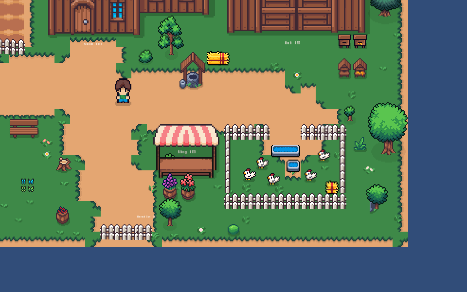
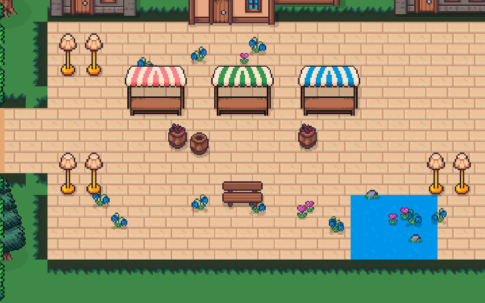

# Monster Farm

A casual **top-down 2D pixel** game built in Unity (2022.3 LTS, URP 2D): grow and raise a stable
of monsters on your farm, then **lead a squad of them into monster-infested villages and clear
them in real-time action combat.** Two connected modes — a calm farm-management loop and an
action-brawler raid — share one squad and one save.

> **Status:** Playable vertical slice. The farm loop (move, plant, harvest, shop, inventory,
> save/load) and the first raid (City1 — four linear combat rooms with a hero you control
> directly) are implemented and play end-to-end. See [Evidence](doc/evidence.md) for what
> changed and where to find it.

## How to Run

**Quickest — play the build.** Download the packaged **Windows build** from the repository
**[Releases](../../releases)** and run `Monster Farm.exe`. The build bundles the licensed art (which is
git-ignored from the source tree), so it plays out of the box.

**From source (for code / process review).**

1. Open the **`MonsterFarm/`** project in **Unity 2022.3 LTS** (URP 2D, New Input System).
2. Open `Assets/Scenes/MainMenu.unity` (or `Farm.unity`) and press **Play**.
3. Walk to the **War Camp** building and interact to deploy a squad into the raid (City1), or open
   `Assets/Scenes/Battle.unity` directly to jump into combat with a test squad.
   *(The art and its derived prefabs/tiles are git-ignored, so a bare clone will not render correctly
   until the Cute Fantasy packs are re-imported — see the licensing note below. To simply play, use the build.)*

Tuned for **1920×1080**.

> **Art assets are not in this repo (licensing).** The **Cute Fantasy** pixel art (by Kenmi) is
> licensed and its terms forbid redistributing the files, so it is **git-ignored and excluded from the
> tracked project** (not redistributed here). Because the art is local-only, the assets derived from it
> — the animated monster prefabs (`Resources/Monsters`, `Resources/MonsterAnim`), the decor prefabs, and
> the tilemap source images (`Tiles/*Src.png`) — are **also git-ignored**, so a fresh clone will not
> render or play as-is. **To play, use the packaged build in [Releases](../../releases).** To rebuild from
> source instead, download the packs from
> [kenmi-art.itch.io/cute-fantasy-rpg](https://kenmi-art.itch.io/cute-fantasy-rpg), import them into
> `MonsterFarm/Assets/Art/CuteFantasy/`, and re-slice the derived prefabs/tiles. Fonts (Pixel Operator,
> Alagard), SFX (Ninja Adventure), and music (three CC0 OpenGameArt tracks) are free/CC0 and **are**
> included. See [Asset Credits](doc/asset-credits.md).

## Screenshots

| Farm | Raid |
|------|------|
|  |  |

## How to Play

**Goal.** On the farm, grow monsters and gear up your squad. In a raid, **lead your squad through
four areas and clear every enemy to reclaim the village.** You lose if your hero falls or the
whole squad is wiped.

### Farm (Farm.unity)
| Input | Action |
|-------|--------|
| **WASD** | Move your avatar |
| **E** | Plant / harvest / interact with a building when standing next to it |
| **Mouse** | Use the shop, seed picker, deploy screen, and other panels |
| **Esc** | Options menu — master / music / SFX volume, **key rebinding**, return to menu, quit |

Buildings: **Shop** (buy monster seeds + combat items), **Lab** (spend resources to permanently
upgrade a strain's HP + attack), **War Camp** (deploy a squad → raid; at the south fence), **Home**
(save).

> **Keyboard controls are rebindable** — open **Esc → Controls** to remap movement, interact, and
> dash; bindings are saved across sessions and can be reset to defaults.

### Raid / Battle (action-brawler)
| Input | Action |
|-------|--------|
| **WASD** | Move your hero (leader) |
| **Left Shift** | Dash |
| **Left click** | Hero melee swing toward the cursor (arc damage + knockback) |
| **Right click** | Command the **whole squad** — focus the enemy under the cursor, or move there |
| **1** | Rotten Onion — repel blast (click to aim/throw) |
| **2** | Freeze Canister — freeze enemies (click to aim/throw) |
| **Esc** | Pause |

Your monster squad auto-follows the hero and auto-engages nearby enemies; you reposition with the
hero, swing to fight alongside them, command the squad with right-click, and spend items when a
fight gets tough. Clearing an area opens the gate to the next; clear the final Village Square to win.

## Features

- **Farm loop** — WASD avatar, plant/harvest on a tile grid with cell highlight, crop growth,
  a monster **inventory**, a **shop** (seeds + items), and **versioned save/load**.
- **Six monster strains** — Brute, Mauler, Runner, Shaman, Spitter, Bomber — each with distinct
  stats and a unique passive (thick hide, bloodlust, evasion, corrosion, healing aura, self-detonate)
  plus a **hunger system** that trades attack power for vulnerability; an in-game **Bestiary** codex
  lists every strain's stats, passive, and backstory.
- **Action-brawler raid** — a directly-controlled hero with a melee swing + dash, an auto-fighting
  squad (units collide + separate and respect walls), throwable items, a four-room **linear level**
  (City1) with area-gated progression, a **minimap**, and a win/lose result screen.
- **Economy & Lab** — earn resources from raids; a **shop** for seeds + combat items and a **Lab** to
  permanently upgrade a strain's HP + attack; every balance number lives in one `GameConfig` asset.
- **Audio** — looping background music per scene (menu / farm / battle) with crossfades, plus a full
  SFX set; master / music / SFX all adjustable from the **Esc options menu**.
- **Cohesive pixel art** — Cute Fantasy tileset with Y-sorted decor, animated monsters and water,
  and a parchment/pixel UI.

## Documentation

Design, process, and submission evidence live under [`doc/`](doc/):

- **[Reference & Creative Contribution](doc/reference-and-contribution.md)** — what inspired the
  game, the reference→transformation table, and what is my own
- **[Accessibility, Security & Social](doc/accessibility.md)** — what's supported and the honest gaps
- **[Evidence index](doc/evidence.md)** — what changed since Session 1, mapped to scenes/scripts/commits
- **[Peer Feedback](doc/peer-feedback.md)** — feedback received and what I changed in response
- **[Asset Credits](doc/asset-credits.md)** — art/audio sources and licenses
- **[Vision](doc/vision.md)** · **[Design Bible](doc/design/)** · **[Roadmap](doc/roadmap.md)** ·
  **[Testing](doc/testing/)**

## My Contribution (solo)

This is a solo project. I **proposed and refined the core idea** — taking the "grow your fighters
like crops" loop from **Zombie Farm** and working out my own details (the six strains and their
passives, the hunger + permadeath risk, and the loop that ties the farm to a real-time raid). The
**design and direction are mine** — the concept, the two-mode loop, the combat feel, and the level
layout. I **designed the scenes** (the farm and the four-room raid) — what each contains and how the
rooms escalate — then used AI to build the basic version and **reworked and hand-tuned them myself**.
The **C# was written with an AI assistant under my direction**: I decided what each system needed,
then reviewed, modified, debugged, and integrated it, and iterated everything from playtest feedback
(see [Use of AI](doc/reference-and-contribution.md#use-of-ai), [Evidence](doc/evidence.md), and
[Peer Feedback](doc/peer-feedback.md)). External assets (art, fonts, audio) are licensed and credited
in [Asset Credits](doc/asset-credits.md).

## Unity Version

Unity **2022.3 LTS**, URP 2D Renderer, New Input System.
